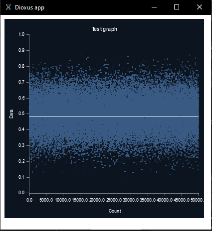

# Plotters-dioxus

Implementation of an [Dioxus](https://github.com/DioxusLabs/dioxus) backend for the rust library [Plotters](https://github.com/plotters-rs/plotters).



## Install

To use plotters-dioxus, you can add the following line into your Cargo.toml:

```toml
[dependencies]
plotters-dioxus = "0.2.0"
```

## Usage

The following code allows you to draw a scatter plot

```rs

#![allow(non_snake_case)]
use dioxus::prelude::*;
use plotters::prelude::*;
use plotters_dioxus::{ Plotters, DioxusDrawingArea };

fn main() {
    dioxus_desktop::launch(App);
}

fn App<'a>(cx: Scope<'a>) -> Element {
    render!(Plotters {
        size: (400, 400),
        init: move |drawing_area: DioxusDrawingArea| {
            drawing_area.fill(&WHITE).expect("The drawing area filling is expected");
            let mut simple_ctx = ChartBuilder::on(&drawing_area)
                .caption("Simple plot", ("sans-serif", 14, &BLACK))
                .margin(10)
                .x_label_area_size(40)
                .y_label_area_size(40)
                .build_cartesian_2d(0f64..1f64, 0f64..1f64)
                .expect("Simple context creation is expected");

            let original_style = ShapeStyle {
                color: BLACK.mix(1.0),
                filled: true,
                stroke_width: 1,
            };

            simple_ctx
                .configure_mesh()
                .disable_x_mesh()
                .disable_y_mesh()
                .y_label_style(("sans-serif", 11, &BLACK).into_text_style(&drawing_area))
                .x_label_style(("sans-serif", 11, &BLACK).into_text_style(&drawing_area))
                .x_desc("Count")
                .y_desc("Data")
                .axis_style(original_style)
                .axis_desc_style(("sans-serif", 11, &BLACK).into_text_style(&drawing_area))
                .draw()
                .expect("Simple configuration creation is expected");
            simple_ctx
                .draw_series(
                    vec![(0.1f64, 0.5f64), (0.5f64, 0.5f64), (0.5f64, 0.1f64)]
                        .iter()
                        .map(|e| Circle::new(*e, 3i32, BLUE))
                )
                .expect("Draw is expected");

            drawing_area
                .present()
                .expect(
                    "Unable to write result to file, please make sure 'plotters-doc-data' dir exists under current dir"
                );
        },
    })
}

```

Check the [demo](./demo/) project for an example more interactive.

### Credits

- [dioxus](https://github.com/DioxusLabs/dioxus)
- [plotters-rs](https://github.com/plotters-rs/)

